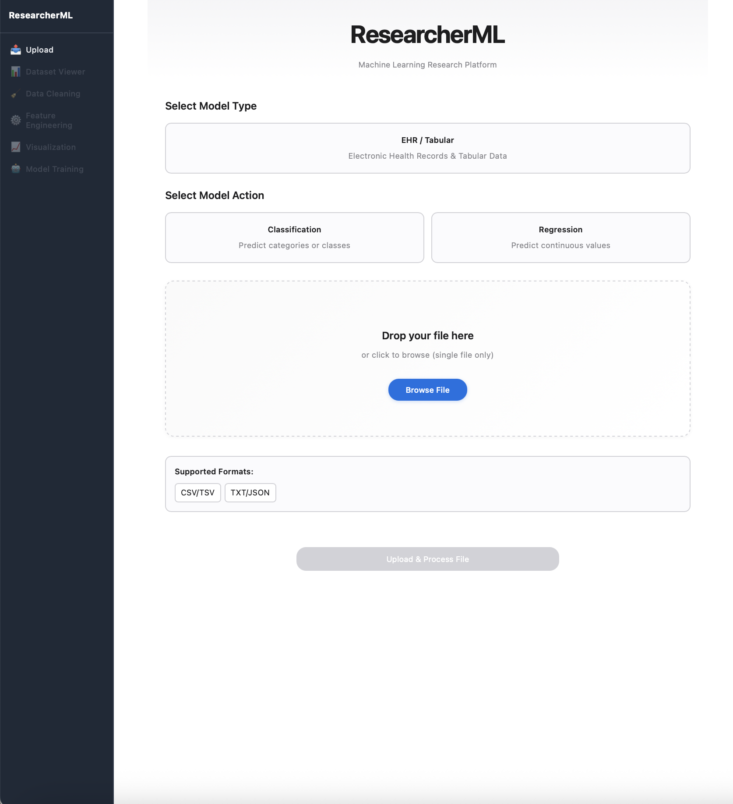
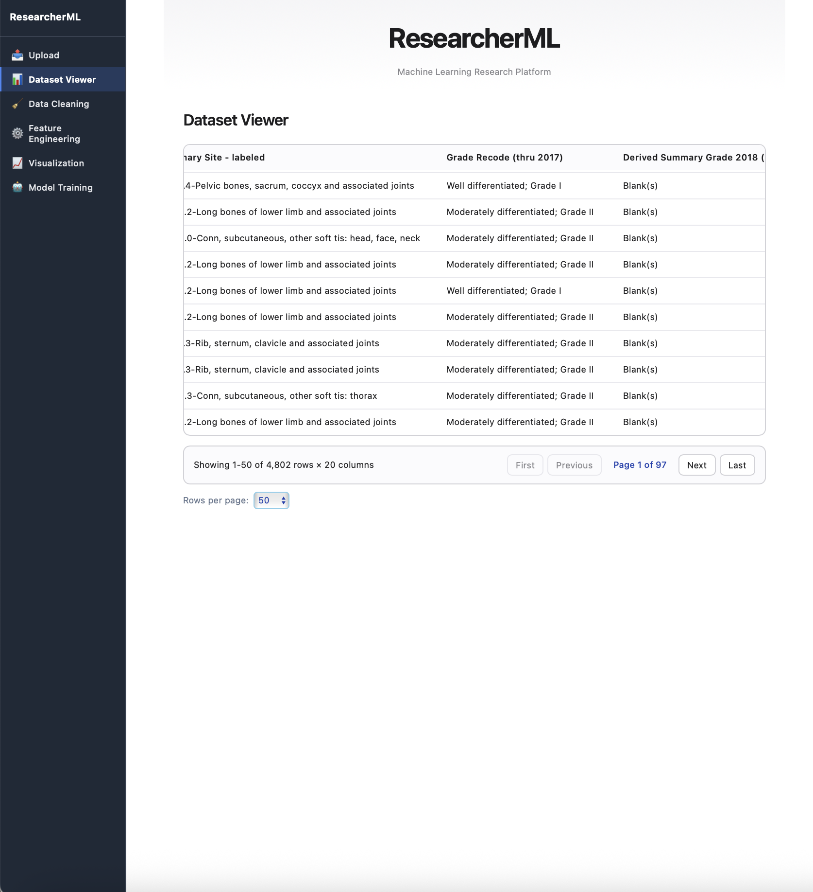
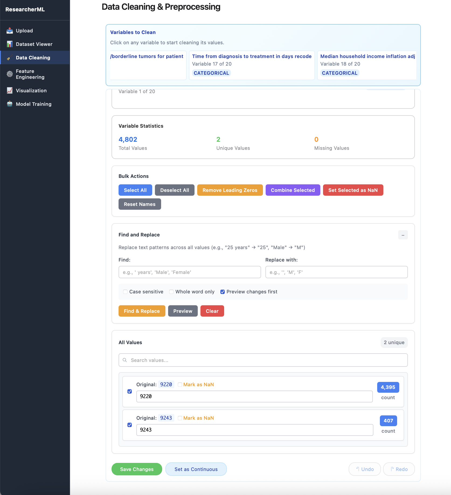
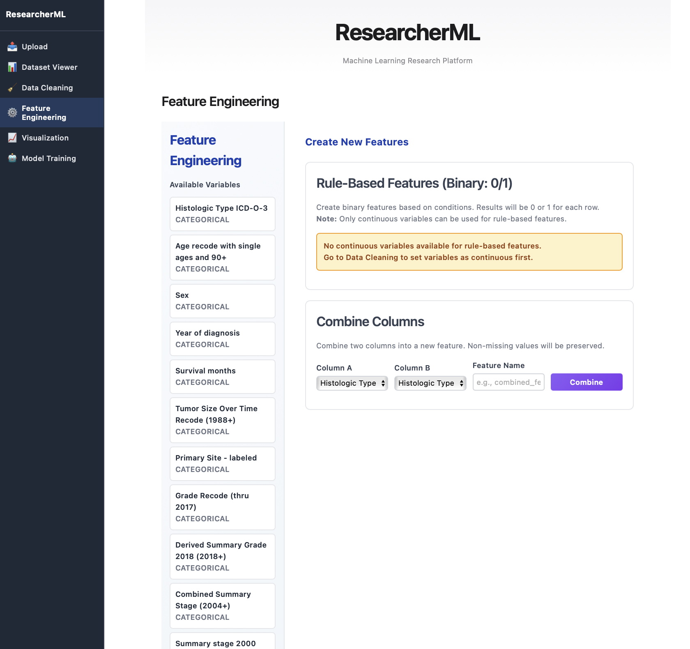
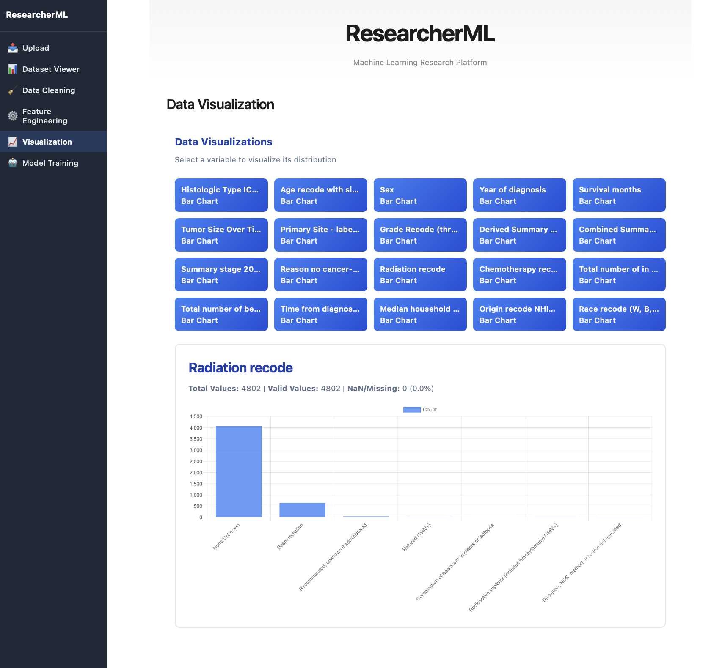
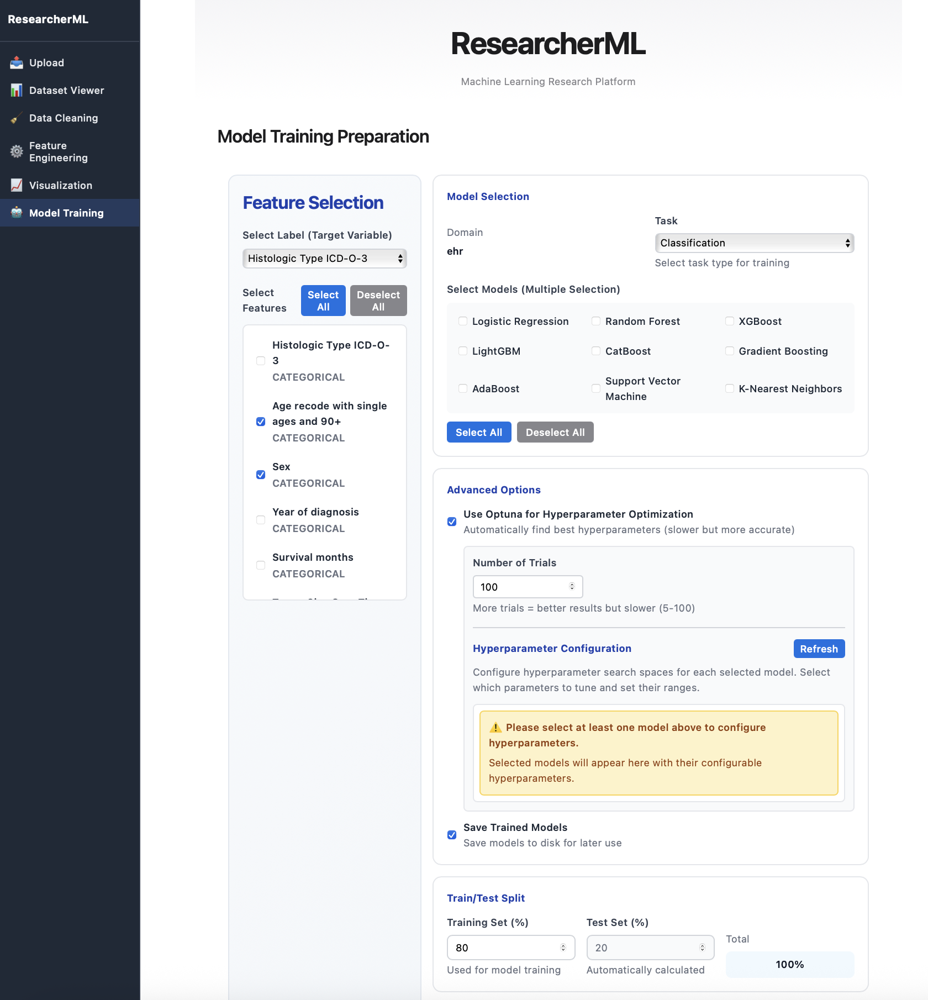

# ResearcherML - Machine Learning Research Platform

A fast, modern platform for data research and machine learning with a vanilla JavaScript frontend and Python FastAPI backend.



## Quick Start

### Option 1: Full Stack (Recommended)
```bash
npm start
```
This will start both backend and frontend servers.

### Option 2: Backend Only
```bash
cd backend
npm start
```

### Option 3: Manual Start
```bash
# Backend
cd backend
python3 main.py

# Frontend (in another terminal)
python3 -m http.server 3000
```

## Features

- **Fast Upload**: Drag & drop or click to upload files
- **Multiple Formats**: Supports CSV, TSV, TXT, JSON, Images, Audio files
- **Smart Detection**: Automatically detects data type (EHR, Imaging, Time Series)
- **Model Selection**: Choose from EHR, Imaging, or Time Series models
- **Clean UI**: Modern, responsive interface built with vanilla JavaScript

### Screenshots

**Data Viewer & Cleaning**




**Feature Engineering & Visualization**




**Model Training**



## Supported File Types

- **Data**: CSV, TSV, TXT, JSON
- **Images**: JPG, PNG, GIF, BMP, TIFF, WebP
- **Audio**: WAV, MP3, FLAC, M4A
- **Folders**: Upload entire folders of images

## API Endpoints

- `GET /` - Health check
- `POST /api/upload` - Upload files and detect data type
- `GET /api/health` - API health status
- `GET /docs` - Interactive API documentation

## Development

```bash
# Backend development mode (auto-reload)
cd backend
npm run dev

# Install dependencies
cd backend
npm run install
```

## Architecture

- **Frontend**: Vanilla JavaScript, HTML5, CSS3
- **Backend**: Python 3, FastAPI, Pandas
- **Storage**: Local file system
- **Ports**: Frontend (3000), Backend (8000)

## Deployment

Want to deploy this app online for free? Check out the [Deployment Guide](DEPLOYMENT.md) for instructions on deploying to Render.com.

## License

MIT License
